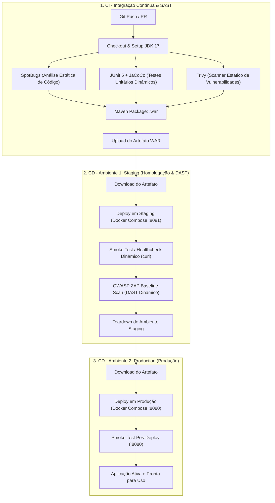

# Sistema Universitário — Gestão de Alunos e Professores & Pipeline CI/CD

Este repositório contém uma aplicação web Java para gerenciamento acadêmico e a implementação completa de um pipeline automatizado de **CI/CD** no **GitHub Actions**, integrando análise estática (SAST), análise dinâmica (DAST), conteinerização com **Docker** e múltiplos ambientes de implantação.

> **Nota de Origem do Projeto:**  
> Este projeto foi originalmente desenvolvido a partir de uma atividade prática da disciplina de **Software para Persistência de Dados**, ministrada pelo professor **Elias Batista**. Ele foi adaptado e utilizado neste repositório para a atividade prática da disciplina de **Implantação e Entrega Contínua de Software**.

---

## 📖 Sobre a Aplicação

A aplicação é um sistema web clássico construído com **Java 17**, baseado no padrão arquitetural MVC (Model-View-Controller) e padrão DAO (Data Access Object), rodando sobre a especificação **Jakarta EE (Servlet API 6.0 e JSTL 3.0)** no servidor de aplicação **Apache Tomcat 10+**.

O objetivo principal do sistema é realizar as operações fundamentais de persistência de dados em um banco **PostgreSQL**, oferecendo:
- **Gestão de Alunos:** Cadastro, listagem em tabela, edição e exclusão de discentes (armazenando identificador, nome, e-mail e curso).
- **Gestão de Professores:** Cadastro, listagem, edição e exclusão de docentes (armazenando identificador, nome, data de nascimento, naturalidade, sexo e link do currículo Lattes).
- **Interface Web:** Telas renderizadas dinamicamente via JSP com folhas de estilo modernas (`css/style.css`).
- **Conexão Dinâmica:** Fábrica de conexões JDBC (`ConnectionFactory`) capaz de se adaptar automaticamente a variáveis de ambiente ou usar parâmetros locais por padrão.

---

## 🛠️ Comandos Automatizados via Makefile

Para facilitar o ciclo de vida local do desenvolvedor e reproduzir cada etapa do pipeline sem depender da nuvem, foi disponibilizado um `Makefile` com tarefas bem definidas:

| Comando | Descrição |
| :--- | :--- |
| `make static-analysis` | Compila o projeto e executa as verificações estáticas de código com SpotBugs, JUnit 5 e relatório JaCoCo. |
| `make staging-dast` | Sobe o ambiente de Staging na porta 8081 via Docker Compose, efetua os testes dinâmicos de fumaça e auditoria DAST, e encerra o ambiente. |
| `make prod` | Constrói e sobe a aplicação no ambiente de produção local (porta 8080) com banco PostgreSQL integrado. |
| `make all` | Executa todas as etapas anteriores em sequência: análise estática, testes em staging e implantação final em produção. |
| `make stop` | Encerra e remove todos os contêineres e volumes ativos de Staging e Produção. |
| `make clean` | Remove artefatos e diretórios temporários gerados pelo Maven. |

---

## 🏗️ Estrutura do Pipeline de CI/CD (GitHub Actions)

O pipeline definido em `.github/workflows/ci-cd.yml` é disparado a cada `push` ou `pull request` para a branch `main`, dividindo o ciclo de entrega em três fases bem delimitadas:



### 1. Job `build-and-static-analysis` (CI & SAST)
- Realiza o checkout do repositório e configura o JDK 17 com cache inteligente de dependências Maven.
- Executa a análise estática com **SpotBugs** no bytecode Java para identificar más práticas e riscos de código.
- Executa testes automatizados com **JUnit 5** e gera métricas de cobertura com **JaCoCo**.
- Inspeciona o repositório e suas dependências com **Trivy** em busca de vulnerabilidades e CVEs conhecidas.
- Gera o pacote `.war` final e o publica como artefato seguro do GitHub Actions.

### 2. Job `deploy-staging` (CD - Ambiente 1: Staging & DAST)
- Utiliza o ambiente formal `staging` do GitHub Actions.
- Sobe os contêineres em porta isolada (`8081` para a web e `5433` para o banco de teste).
- Valida em tempo real a prontidão da aplicação através de *healthcheck* dinâmico via `curl`.
- Executa a análise dinâmica de vulnerabilidades (DAST) contra a aplicação em execução com a ferramenta **OWASP ZAP Baseline Scan**.
- Destrói os contêineres temporários de staging ao final do processo.

### 3. Job `deploy-production` (CD - Ambiente 2: Production)
- Utiliza o ambiente formal `production` do GitHub Actions, dependendo da aprovação prévia dos estágios anteriores.
- Realiza a implantação oficial via Docker Compose na porta `8080` com o banco PostgreSQL persistente na porta `5432`.
- Valida o status do deploy confirmando resposta HTTP 200/302 da aplicação.

---

## 🚀 Como Executar Localmente

### Usando o Makefile (Recomendado)
```bash
# Executar a esteira completa localmente (análise estática, staging dinâmico e deploy de produção)
make all

# Ou apenas subir em produção
make prod
```

### Usando diretamente o Docker Compose
```bash
docker compose up -d --build
```

Após a inicialização, os serviços estarão acessíveis nas seguintes rotas:
- Página Inicial: [http://localhost:8080/](http://localhost:8080/)
- Gestão de Alunos: [http://localhost:8080/alunos](http://localhost:8080/alunos)
- Cadastro de Alunos: [http://localhost:8080/cadastro.jsp](http://localhost:8080/cadastro.jsp)
- Gestão de Professores: [http://localhost:8080/professores](http://localhost:8080/professores)
- Cadastro de Professores: [http://localhost:8080/cadastro_professor.jsp](http://localhost:8080/cadastro_professor.jsp)

Para encerrar os serviços locais:
```bash
make stop
# ou: docker compose down -v
```
