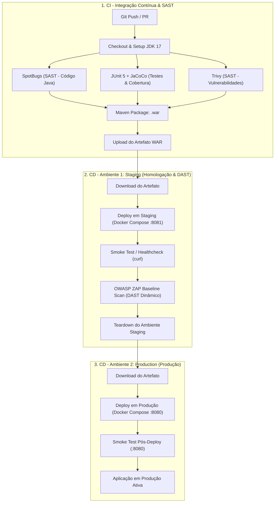

# Laboratório de Persistência e Pipeline CI/CD

Repositório dedicado à disciplina de **Implantação e Entrega Contínua de Software**, implementando um pipeline automatizado de **CI/CD** com **GitHub Actions**, conteinerização com **Docker & Docker Compose**, e testes de segurança e qualidade com **análise estática (SAST)** e **análise dinâmica (DAST)**.

---

## 🏗️ Visão Geral da Arquitetura do Pipeline

O pipeline foi estruturado em **3 Jobs principais** cobrindo os conceitos de Integração Contínua (CI) e Entrega Contínua (CD), passando por dois ambientes distintos:



---

## ❓ Resposta sobre a Dúvida dos Dois Ambientes: *Cloud vs Self-Hosted ou Staging vs Produção?*

> **Dúvida:** *"Sobre a questão dos dois ambiente, seria um self-hosted e outro cloud (do github)? Fiquei com essa dúvida"*

Na engenharia de software e no ecossistema do **GitHub Actions**, a expressão **"ambientes"** pode ser abordada sob duas óticas fundamentais:

1. **Ambientes Lógicos de Entrega (Staging & Production - Abordagem Principal):**
   - É o padrão da indústria e a funcionalidade nativa do GitHub Actions (`environment: staging` e `environment: production`).
   - **Ambiente 1 (Staging / Homologação):** Ambiente isolado onde a nova versão é testada dinamicamente com testes de fumaça e varredura DAST (OWASP ZAP) antes de qualquer impacto ao usuário final.
   - **Ambiente 2 (Production / Produção):** Ambiente final onde a aplicação validada é promovida e disponibilizada para consumo real.
   - Esse pipeline implementa nativamente esses dois ambientes no arquivo de workflow.

2. **Ambientes de Infraestrutura de Execução (Runners: Cloud vs Self-Hosted):**
   - **Cloud Runner (`runs-on: ubuntu-latest`):** A máquina virtual gerenciada na nuvem do GitHub, ideal para jobs de compilação, testes e validação.
   - **Self-Hosted Runner (`runs-on: self-hosted`):** Um servidor ou máquina local configurada para executar jobs do GitHub Actions na infraestrutura própria.
   - **Flexibilidade:** No job `deploy-production`, basta alterar `runs-on: ubuntu-latest` para `runs-on: self-hosted` caso o objetivo seja realizar a implantação fisicamente na máquina local do desenvolvedor ou servidor on-premise da instituição.

---

## 🛠️ Ferramentas Utilizadas

### 1. Verificação Estática (SAST - Static Application Security Testing)
- **SpotBugs (`spotbugs-maven-plugin`):** Realiza a análise estática do bytecode Java em busca de más práticas, bugs em potencial e inconsistências (ex.: campos não serializáveis, tratamento indevido de exceções).
- **Trivy (`aquasecurity/trivy-action`):** Scanner estático de segurança que inspeciona o repositório, bibliotecas e dependências declaradas em busca de vulnerabilidades conhecidas (CVEs).

### 2. Verificação Dinâmica (DAST & Testes Automatizados em Tempo de Execução)
- **JUnit 5 + JaCoCo:** Testes unitários dinâmicos que validam os modelos (`AlunoTest`, `ProfessorTest`) e calculam a cobertura de execução em tempo de teste.
- **Healthcheck Dinâmico / Smoke Test (`curl`):** Script que efetua requisições HTTP reais contra a porta do container após o deploy para validar a resposta do Apache Tomcat (`HTTP 200/302`).
- **OWASP ZAP Baseline Scan (`zaproxy/action-baseline`):** Scanner dinâmico de vulnerabilidades web (DAST) que ataca a aplicação em execução no ambiente de Staging para encontrar brechas (cabeçalhos de segurança ausentes, cookies inseguros, etc.).

---

## 📋 Detalhamento dos Jobs e Comandos

| Job | Ambiente | Comandos Principais | Objetivo |
| :--- | :--- | :--- | :--- |
| **`build-and-static-analysis`** | Cloud (`ubuntu-latest`) | `mvn compile spotbugs:check`<br>`mvn test jacoco:report`<br>`trivy fs .`<br>`mvn package -DskipTests` | Integração Contínua, testes unitários, análise de bugs e vulnerabilidades estáticas, e geração do pacote `.war`. |
| **`deploy-staging`** | `staging` (`:8081`) | `APP_PORT=8081 DB_PORT=5433 docker compose up -d --build`<br>`curl -f http://localhost:8081/`<br>`action-baseline (OWASP ZAP)`<br>`docker compose down -v` | Implantação no primeiro ambiente, validação dinâmica de disponibilidade e auditoria DAST em tempo de execução. |
| **`deploy-production`** | `production` (`:8080`) | `APP_PORT=8080 DB_PORT=5432 docker compose up -d --build`<br>`curl -f http://localhost:8080/` | Implantação oficial no ambiente final de produção e verificação pós-deploy. |

---

## 🚀 Como Executar Localmente via Docker

Para rodar a aplicação completa (PostgreSQL + Tomcat 10) na sua máquina sem necessidade de instalar Java ou Postgres localmente:

### 1. Iniciar os serviços
```bash
docker compose up -d --build
```

### 2. Acessar a aplicação
- Página Inicial: [http://localhost:8080/](http://localhost:8080/)
- Cadastro de Alunos: [http://localhost:8080/cadastro.jsp](http://localhost:8080/cadastro.jsp)
- Lista de Alunos: [http://localhost:8080/aluno](http://localhost:8080/aluno)
- Cadastro de Professores: [http://localhost:8080/cadastro_professor.jsp](http://localhost:8080/cadastro_professor.jsp)
- Lista de Professores: [http://localhost:8080/professor](http://localhost:8080/professor)

### 3. Parar os serviços
```bash
docker compose down -v
```
